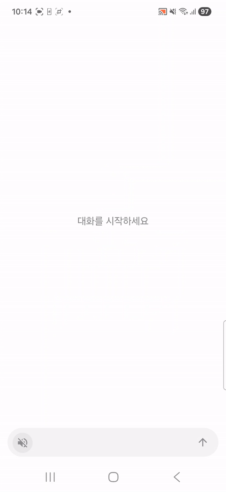

# Case — AI 음성 에이전트 시스템

개인용 AI 비서 **Case**의 풀스택 시스템입니다. 음성 명령과 텍스트 채팅을 통해 AI와 대화하고, 로컬 머신에서 명령을 실행할 수 있습니다.

## 데모



## 아키텍처

중앙 Hub가 Android 요청을 받고 채팅 provider와 메모리 저장을 같은 프로세스에서 처리합니다.

```
┌─────────────────┐
│  Android Client  │
│  (Expo / React   │
│   Native)        │
└────────┬────────┘
         │
    ┌────▼────┐
    │   Hub   │  Node.js / Fastify (port 5000)
    │         │  Codex / Claude / GPT / Ollama / Memory
    └─────────┘
```

| Provider | 역할                                  |
| -------- | ------------------------------------- |
| GPT      | OpenAI GPT 기반 채팅 처리             |
| Memory   | Hub 내장 대화 컨텍스트 및 메모리 저장/조회 |
| Ollama   | 로컬 LLM(Ollama) 기반 채팅            |
| Claude   | Claude Code CLI 기반 레거시 명령 실행 |
| Codex    | Codex CLI를 통한 로컬 명령 실행       |

## 주요 기능

- **음성 입력 & 웨이크워드 감지** — "케이스" 호출 시 자동 음성 인식 시작, 레인보우 글로우 효과
- **TTS 응답** — AI 응답을 음성으로 출력
- **컨텍스트 메모리** — 대화 맥락을 기억하고 활용
- **명령 실행** — 자연어로 로컬/원격 머신 명령 수행 (fire-and-forget + 결과 폴링)
- **생체 인증** — 앱 실행 시 지문/얼굴 인식 잠금
- **배터리 최적화 해제** — 백그라운드 음성 감지를 위한 자동 권한 요청

## 기술 스택

| 영역       | 기술                                  |
| ---------- | ------------------------------------- |
| 클라이언트 | React Native, Expo SDK 54, TypeScript |
| Hub        | Node.js, Fastify                      |
| Worker assets | Hub 내부 provider docs 및 legacy Python worker 코드 |
| AI         | OpenAI GPT, Codex CLI, Claude Code CLI, Ollama |
| 인프라     | 단일 Hub 프로세스                     |

## 프로젝트 구조

```
case/
├── hub/              # 중앙 Fastify 서버
│   └── workers/      # Hub provider docs 및 legacy worker 코드
└── android/          # Expo React Native 앱
```

## 서버 실행

처음 실행 전에는 Hub 의존성을 설치합니다.

```bash
cd hub && pnpm install && cd ..
```

루트에서 `run_servers.sh`를 실행하면 Hub가 시작됩니다. 채팅 provider(Codex, Claude, GPT, Ollama)와 메모리 저장소는 Hub 프로세스 안에서 처리됩니다.

```bash
./run_servers.sh
```

Ollama가 실제 채팅을 처리하려면 `OLLAMA_MODEL`에 맞는 모델이 로컬 Ollama에 설치되어 있어야 합니다. 메모리는 기본적으로 `hub/data/memories.json`에 저장되며 `MEMORY_DATA_DIR`로 위치를 바꿀 수 있습니다.

### Hub 토큰 인증

Hub의 `/chat`, `/context*`, `/command*`, `/commands*` 경로는 `X-Case-Hub-Token` 헤더 또는 `Authorization: Bearer <token>`이 필요합니다. `/health`, `/robots.txt`, `/auth/refresh-local`은 공개 경로지만, refresh는 loopback/private LAN 요청에서만 동작하고 Cloudflare/public forwarded 요청으로 보이면 거부됩니다.

토큰이 아직 없으면 같은 LAN에서 Android 앱을 한 번 열어 `POST /auth/refresh-local`이 성공하게 하거나, 수동으로 `CASE_HUB_TOKEN`을 설정해 시작하세요. refresh는 기본 24시간에 최초 1회만 새 토큰을 만들고, 이전 토큰은 기본 30분 동안 함께 허용해 앱 잠금을 피합니다. 토큰 상태는 기본적으로 `hub/data/auth-token.json`에 저장되며 원자적으로 쓰고 파일 권한을 제한합니다.

주요 설정:

```bash
APP_ENV=production|development             # development allows local/LAN requests without a token
CASE_HUB_TOKEN=...                         # 초기/고정 또는 비상 fallback 토큰
CASE_HUB_TOKEN_GRACE_SECONDS=1800          # 이전 토큰 허용 시간
CASE_HUB_TOKEN_ROTATION_INTERVAL_HOURS=24  # 0이면 기존 토큰 유지
CASE_HUB_TOKEN_FILE=auth-token.json        # MEMORY_DATA_DIR 아래 저장 파일명
```

Android 앱은 시작 시 `/auth/refresh-local`을 먼저 시도하고 성공한 토큰을 저장한 뒤 Hub 요청에 `X-Case-Hub-Token`을 붙입니다. 외부망에서 refresh가 실패해도 기존 저장 토큰으로 계속 요청합니다.

Cloudflare 앞단에서는 Hub 자체 인증과 별도로 `/.git*`, `/wp-*`, `/xmlrpc.php`를 차단하고, 가능하면 `/chat`, `/context*`, `/command*`, `/commands*`에는 Cloudflare Access 또는 토큰 전제를 둡니다.

자주 쓰는 옵션:

```bash
./run_servers.sh --env development
CHAT_PROVIDER=gpt OPENAI_API_KEY=... ./run_servers.sh
CHAT_PROVIDER=ollama OLLAMA_MODEL=... ./run_servers.sh
./run_servers.sh --dry-run
```

## 설정

### Android 음성 게이트 롤링 버퍼

음성 게이트의 롤링 오디오 버퍼는 승인된 음성 인식 전 캡처 구간을 기기 내 임시 메모리에만 보관합니다. 기본 길이는 `ROLLING_BUFFER_DEFAULT_DURATION_SECONDS`에서 정의하며 값은 `15`초로 고정됩니다.

| 옵션 | 기본값 | 유효 범위 | 단위 | 설정 위치 |
| ---- | ------ | --------- | ---- | --------- |
| `ROLLING_BUFFER_DURATION_SECONDS` | `15` | `1` 이상 `60` 이하 | seconds | 명시적 롤링 버퍼 활성 길이 오버라이드 바인딩 |
| `rollingBufferActiveDurationSeconds` | `15` | `1` 이상 `60` 이하 | seconds | Android 앱의 롤링 버퍼 사용자 설정 |
| `rolling_buffer_default_duration_seconds` | `15` | 고정 | seconds | 내보낸 롤링 버퍼 설정 스키마 |
| `rolling_buffer_active_duration_seconds` | `15` | `1` 이상 `60` 이하 | seconds | 내보낸 롤링 버퍼 설정 스키마 |

수동 변경은 `ROLLING_BUFFER_CUSTOMIZATION_SOURCE`가 가리키는 명시적 오버라이드 바인딩인 `ROLLING_BUFFER_DURATION_SECONDS`를 설정할 때만 적용됩니다. 이 바인딩의 기본값은 `ROLLING_BUFFER_DEFAULT_DURATION_SECONDS`에서 온 `15`초이며, 해석 결과는 `rolling_buffer_active_duration_seconds`에만 매핑됩니다. 저장된 사용자 설정은 활성 값을 `rollingBufferActiveDurationSeconds`로 보관하고 `rollingBufferCustomizationSource: "ROLLING_BUFFER_DURATION_SECONDS"`와 `rollingBufferDefaultConfigName: "ROLLING_BUFFER_DEFAULT_DURATION_SECONDS"`를 함께 기록해 어떤 값이 활성 오버라이드이고 어떤 값이 권위 있는 기본 바인딩인지 구분합니다.

해석 규칙은 고정되어 있습니다. 명시적 `ROLLING_BUFFER_DURATION_SECONDS` 오버라이드나 저장된 `rollingBufferActiveDurationSeconds`가 없거나 `null`이면 `rolling_buffer_active_duration_seconds`는 `ROLLING_BUFFER_DEFAULT_DURATION_SECONDS`에서 해석된 `15`초입니다. 유효한 오버라이드 값이 있으면 활성 길이만 해당 초 수로 바뀌고, `ROLLING_BUFFER_DEFAULT_DURATION_SECONDS`와 `rolling_buffer_default_duration_seconds`는 계속 `15`초입니다. 기존 호환용 `rollingBufferDurationSeconds` 또는 `rolling_buffer_duration_seconds` 필드는 해석이 끝난 현재 활성 길이를 보여주는 별칭일 뿐이며, 입력이나 저장 설정에서 수동 변경 소스로 사용할 수 없습니다.

## 연락처

[](mailto:cdnwellhk@gmail.com)
[](https://github.com/cdnwells)
